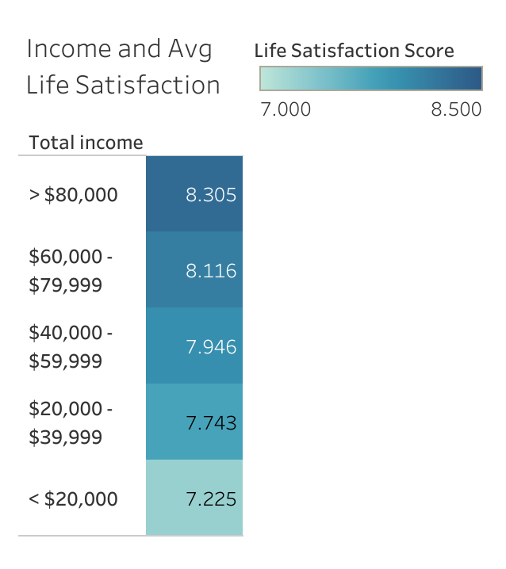
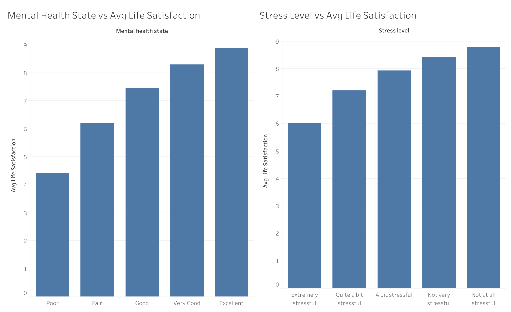
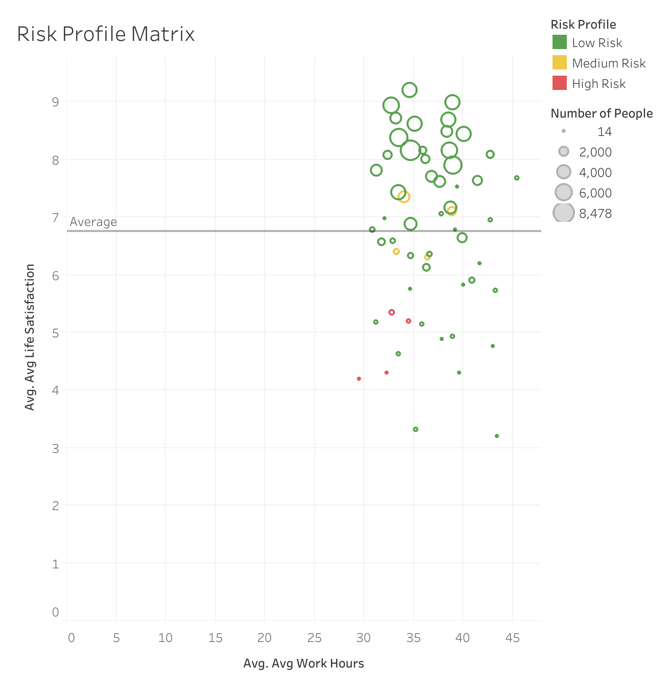
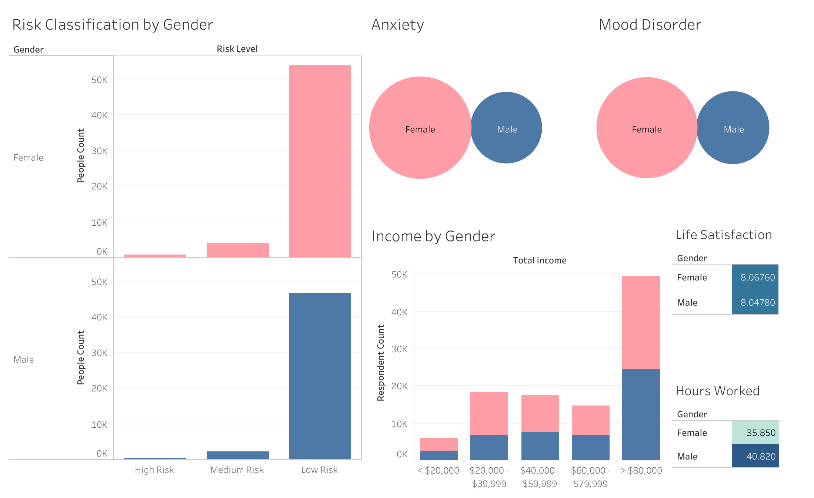

# Uncovering Drivers of Life Satisfaction: A Healthcare Survey Analysis

This project explores how various social, economic, and psychological factors influence **life satisfaction**. Leveraging data from a Canadian healthcare survey, I applied **SQL** for data wrangling and **Tableau** for visualization to uncover patterns and segment respondents into **mental health risk profiles**.

> **Key Variables Explored**: Life satisfaction, income, stress, mental health, gender, and work hours.

> **Link to Data**: [Canadian Healthcare Survey Data](https://www.kaggle.com/datasets/aradhanahirapara/healthcare-survey?select=Health_Dataset_Decoding_and_mapping_dictionary.docx)

---

## Project Objective

To identify key determinants of life satisfaction and evaluate how multiple dimensions (e.g., income, stress, mental state) interact to create **high-risk vs low-risk mental health profiles**.

---

## Tools & Skills Used

- **SQL (MySQL)** – data wrangling, transformation, aggregation
- **Tableau Public** – dashboard development & storytelling
- **Exploratory Data Analysis (EDA)** – segmentation, multivariate profiling
- **Data Cleaning** – value mapping, null handling, type conversions

---

## Data Preparation Highlights

All raw survey data was cleaned and transformed using SQL. Here’s a snapshot of what was done:

- **Categorical mapping** (e.g., income levels, stress ratings, gender)
- **Outlier removal** (e.g., invalid physical activity or life satisfaction entries)
- **Creation of derived features**, such as multivariate `Risk_Profile`
- **Subsetting data** into `chronic` and `mental` tables for focused analysis

Example transformation:
```sql
UPDATE mental
SET Stress_level = CASE
  WHEN Stress_level = 1 THEN 'Not at all stressful'
  WHEN Stress_level = 5 THEN 'Extremely stressful'
  ELSE NULL
END;
```

Risk Profile Classification Logic:
```sql
CASE
  WHEN Stress_level IN ('Quite a bit stressful', 'Very stressful')
       AND Mental_health_state IN ('Poor', 'Fair')
       AND Total_income IN ('< $20,000', '$20,000 - $39,999')
  THEN 'High Risk'
  ...
```

This logic was used to classify respondents into **Low**, **Medium**, or **High Risk** mental health categories.
---

## Visualization Deep Dive

### Income vs Life Satisfaction



This heatmap clearly shows a **positive relationship between income and life satisfaction**:
- Respondents earning **over $80,000** report the highest average life satisfaction (**8.31**).
- Life satisfaction **decreases steadily** across income brackets, with those earning **under $20,000** reporting a much lower average (**7.23**).
- This gradient suggests that **economic security plays a substantial role** in how individuals perceive their overall life satisfaction.

---

### Mental Health & Stress vs Life Satisfaction



This dual bar chart reveals the **strong correlation between mental health, stress, and life satisfaction**:
- Individuals with **excellent mental health** score an average of **8.9**, while those with **poor mental health** average just **4.4**.
- Similarly, **stress levels** show an inverse relationship with satisfaction:
  - **Not at all stressful**: Avg satisfaction of **8.8**
  - **Extremely stressful**: Avg satisfaction of only **6.0**

These trends reinforce the impact of **psychological well-being** on how individuals evaluate their quality of life.

---

### Multivariate Risk Profile Matrix



This scatterplot maps subgroups based on their **average weekly work hours (x-axis)** and **average life satisfaction (y-axis)**. The data points are color-coded by **risk profile** (Low, Medium, High), and bubble size represents the **number of respondents** in each group.

#### Key Insights:

- **High-Risk Individuals**:
  - Tend to work **fewer hours** (generally **under 35 hours/week**).
  - Still report **low life satisfaction** scores (between **4.0–6.0**).
  - This indicates that **low workload does not equate to higher well-being**, other factors like **poor mental health, low income, or high stress** are likely at play.

- **Low-Risk Individuals**:
  - Work a **moderate to high number of hours** (often between **35–42 hours/week**).
  - Still maintain **high life satisfaction**, often above **7.0**.
  - Suggests that **resilience factors** (e.g., good mental health, higher income, low stress) may **buffer the effects of longer work hours**.

- **Medium-Risk Individuals**:
  - Occupy a **middle zone**, both in terms of hours and satisfaction (typically **6.0–7.5** life satisfaction and **35–40 work hours**).
  - This group could benefit most from **preventative interventions** in stress management and mental health support.

---

#### Summary Table

| Risk Profile  | Avg. Life Satisfaction | Avg. Work Hours   | Likely Interpretation                                 |
|---------------|------------------------|--------------------|--------------------------------------------------------|
| Low Risk      | > 7.0                  | 35–42 hrs/week     | Balanced work-life; protected by good mental health/income |
| Medium Risk   | 6.0–7.5                | 35–40 hrs/week     | Transitional zone; responsive to support              |
| High Risk     | < 6.0                  | < 35 hrs/week      | Low satisfaction despite fewer hours; deeper issues present |

---

**Conclusion**:  
This matrix reveals that **work hours alone are not predictive of life satisfaction or mental health risk**. Instead, the interplay between **income, stress, and mental health** must be considered. In fact, **some high-risk individuals work fewer hours**, highlighting the importance of **psychosocial and economic support**, not just workload management. 

---

### Mental Health & Gender Trends



- **Females** report higher anxiety and mood disorder rates but similar life satisfaction scores as males.
- **Work hours** tend to be higher in males, but it does not seem to impact life satisfaction.
- **Risk-Profiles** are similar amongst both males and females.

---

## Summary of Findings

- **Mental health and stress** are the most influential predictors of life satisfaction, more so than income or workload.
- **High-income individuals** (>$80,000) report greater satisfaction (8.31), but those benefits decline with poor mental health.
- **Gender patterns** reveal that females report more anxiety/mood disorders yet have slightly higher satisfaction scores than males, suggesting potential resilience or protective factors.
- A **multivariate risk matrix** shows:
  - **Low-risk individuals** report the highest satisfaction and often work more hours.
  - **High-risk individuals** report low satisfaction even with fewer work hours, emphasizing that **underlying mental and financial stressors** are more impactful than workload alone.

In short, this project supports data-driven decision-making in both **healthcare** and **organizational settings** by uncovering the hidden drivers of well-being.
---

## Real World Applications

This analysis demonstrates how healthcare survey data can be transformed into practical insights that support:
- **Targeted healthcare policy** in vulnerable populations
- **Employer wellness strategies** that go beyond hours worked
- **Evidence-based public policy** addressing life satisfaction through economic and psychological support
- **Mental Health Campaigns**: Focus outreach on stressed, low-income individuals with poor mental health indicators.

---

## Future Directions

- **Predictive modeling**: Use machine learning to forecast life satisfaction
- **Geographic comparisons**: Use regional data to study variation across provinces
- **Time-series tracking**: Explore changes over time

---

## Tableau Dashboard (Interactive)

[View full dashboards on Tableau Public](#)  
_(https://public.tableau.com/app/profile/jovan.rai/vizzes)_
