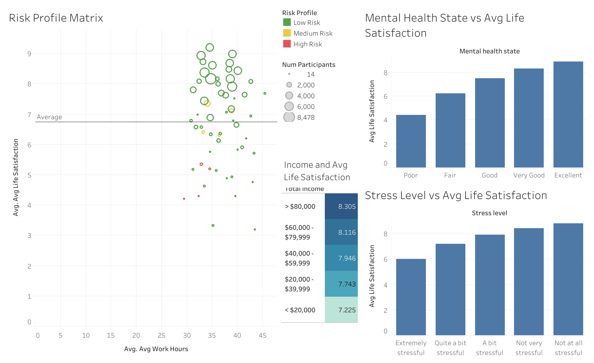

# Uncovering Drivers of Life Satisfaction: A Healthcare Survey Analysis

This project explores how various social, economic, and psychological factors influence **life satisfaction**. Leveraging data from a Canadian healthcare survey (https://www.kaggle.com/datasets/aradhanahirapara/healthcare-survey?select=Health_Dataset_Decoding_and_mapping_dictionary.docx), I applied **SQL** for data wrangling and **Tableau** for visualization to uncover patterns and segment respondents into **mental health risk profiles**.

> **Key Variables Explored**: Life satisfaction, income, stress, mental health, gender, and work hours.

---

## Project Objective

To identify key determinants of life satisfaction and evaluate how multiple dimensions (e.g., income, stress, mental state) interact to create **high-risk vs low-risk mental health profiles**.

---

## Tools & Skills Used

- **SQL (MySQL)** – data wrangling, transformation, aggregation
- **Tableau Public** – dashboard development & storytelling
- **Exploratory Data Analysis (EDA)** – segmentation, multivariate profiling
- **Data Cleaning** – value mapping, null handling, type conversions

---

## Data Preparation Highlights

All raw survey data was cleaned and transformed using SQL. Here’s a snapshot of what was done:

- **Categorical mapping** (e.g., income levels, stress ratings, gender)
- **Outlier removal** (e.g., invalid physical activity or life satisfaction entries)
- **Creation of derived features**, such as multivariate `Risk_Profile`
- **Subsetting data** into `chronic` and `mental` tables for focused analysis

Example transformation:
```sql
UPDATE mental
SET Stress_level = CASE
  WHEN Stress_level = 1 THEN 'Not at all stressful'
  WHEN Stress_level = 5 THEN 'Extremely stressful'
  ELSE NULL
END;
```

---

## Dashboard Snapshots

### Risk Matrix: Life Satisfaction vs Work Hours



- **Low-Risk** individuals cluster above the average line in life satisfaction.
- **High-Risk** individuals tend to work more and report below-average satisfaction.
- **Bubble size** represents sample size; color encodes risk level.

- **Higher income** consistently predicts higher satisfaction.
- **Mental health state** and **stress** strongly correlate with life satisfaction.

---

### Mental Health & Gender Trends


- **Females** report higher anxiety and mood disorder rates but similar life satisfaction scores as males.
- **Work hours** tend to be higher in males, but it does not seem to impact life satisfaction.
- **Risk-Profiles** are similar amongst both males and females.

---

## Key Findings

- **Mental health & stress** are stronger predictors of life satisfaction than income alone.
- Individuals earning **> $80,000** report an average life satisfaction of **8.31**, compared to **7.22** for those under **$20,000**.
- People with **poor mental health** average **4.5/10** in satisfaction, vs **8.9/10** for those with **excellent** mental health.
- **Females** show higher levels of mood/anxiety disorders, yet their **average satisfaction** is slightly higher than males.

---

## Risk Profile Classification Logic

**SQL**
```
CASE
  WHEN Stress_level IN ('Quite a bit stressful', 'Very stressful')
       AND Mental_health_state IN ('Poor', 'Fair')
       AND Total_income IN ('< $20,000', '$20,000 - $39,999')
  THEN 'High Risk'
  ...
```

This logic was used to classify respondents into **Low**, **Medium**, or **High Risk** mental health categories.

---

## Applications

- **Healthcare Policy**: Design targeted interventions for high-risk groups.
- **Workplace Wellness**: Balance workloads to reduce burnout and boost satisfaction.
- **Mental Health Campaigns**: Focus outreach on stressed, low-income individuals with poor mental health indicators.

---

## Future Directions

- **Predictive modeling**: Use machine learning to forecast life satisfaction
- **Geographic comparisons**: Use regional data to study variation across provinces
- **Time-series tracking**: Explore changes over time (if multi-year data is collected)

---

## Tableau Dashboard (Interactive)

[View full dashboards on Tableau Public](#)  
_(https://public.tableau.com/app/profile/jovan.rai/vizzes)_
